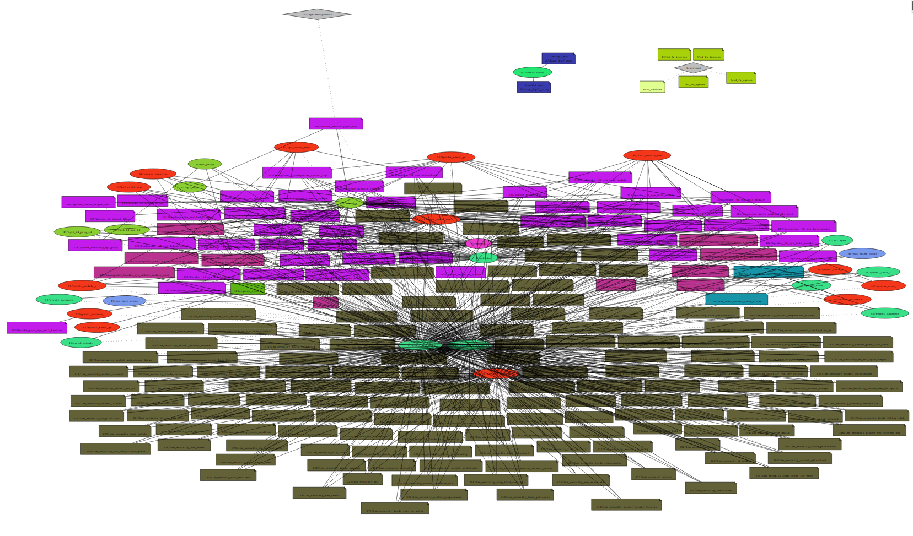

# krie
- Dump: [3a3549ff75bafbf103edf0ca3a5cdb39.7z](https://owncloud.fraunhofer.de/index.php/s/i88sl3p69HbxpAC)
- ISF: [38af54e756b759b46c7e6810b98a6bdf.7z](https://owncloud.fraunhofer.de/index.php/s/lRtAXFOO1KMsiuH)

[Linux Kernel Runtime Integrity with eBPF (krie)](https://github.com/gui774ume/krie)
is a very interesting research project by Guillaume Fournier.
The work contains original ideas on the problem of mitigating Linux
kernel exploits using BPF. For example, krie explores the possibilities
to use BPF to enforce CFI at certain points
in order to make it harder for kernel ROP chains to call
`prepare_kernel_creds` and `commit_creds`, which is commonly used in
attacks to give the exploiting process root privileges.
See his
[presentation](https://www.blackhat.com/us-22/briefings/schedule/index.html#return-to-sender---detecting-kernel-exploits-with-ebpf-27127)
for more information.

kire is a good example as it loads about 214 BPF programs (`lsm`: 148,
`tracepoint`: 10, `kprobe`: 46, `perf_event`: 2, `cgroup_sysctl`: 1)
and 31 maps ( 1 array, 9 hash, 5 lru_hash, 13 percpu_array,
1 perf_event_array, 2 prog_array). An overview of the processes that
hold BPF resources can be obtained using the `bpf_listproc` plugin.
```
# vol.py -f /io/dumps/krie-3410c66d-26be0e1ef560.elf linux.bpf_listproc
Volatility 3 Framework 2.4.2
Progress:  100.00               Stacking attempts finished
PID     COMM    PROGS   MAPS    LINKS

1       systemd 6,7,8,9,10
121     systemd-journal         37
1025    krie    221,222,223,224,225,226,227,228,229,230,231,232,233,234,235,236,237,238,239,240,241,242,243,244,245,246,247,248,249,250,251,252,253,254,255,256,257,258,259,260,261,262,263,264,265,266,267,268,269,270,271,272,273,274,275,276,277,278,279,280,281,282,283,284,285,286,287,288,289,290,291,292,293,294,295,296,297,298,299,300,301,302,303,304,305,306,307,308,309,310,311,312,313,314,315,316,317,318,319,320,321,322,323,324,325,326,327,328,329,330,331,332,333,334,335,336,337,338,339,340,341,342,343,344,345,346,347,348,349,350,351,352,353,354,355,356,357,358,359,360,361,362,363,364,365,366,367,368,369,370,371,372,373,374,375,376,377,378,379,380,381,382,383,384,385,386,387,388,389,390,391,392,393,394,395,396,397,398,399,400,401,402,403,404,405,406,407,408,409,410,411,412,413,414,415,416,417,418,419,420,421,422,423,424,425,426,427 38,39,40,41,42,43,44,45,46,47,48,49,50,51,52,53,54,55,56,57,58,59,60,61,62,63,64,65,66,54  151,152,153,154,155,156,157,158,159,160,161,162,163,164,165,166,167,168,169,170,171,172,173,174,175,176,177,178,179,180,181,182,183,184,185,186,187,188,189,190,191,192,193,194,195,196,197,198,199,200,201,202,203,204,205,206,207,208,209,210,211,212,213,214,215,216,217,218,219,220,221,222,223,224,225,226,227,228,229,230,231,232,233,234,235,236,237,238,239,240,241,242,243,244,245,246,247,248,249,250,251,252,253,254,255,256,257,258,259,260,261,262,263,264,265,266,267,268,269,270,271,272,273,274,275,276,277,278,279,280,281,282,283,284,285,286,287,288,289,290,291,292,293,294,295,296,297,298
```

To find out more about how krie works we can list all programs in the
dump and grep for the one we are interested in.
```
# vol.py -f /io/dumps/krie-3410c66d-26be0e1ef560.elf linux.bpf_listprogs | rg 'kprobe_commit_creds'
OFFSET (V)      ID      NAME    TYPE    LOADED AT       HELPERS MAPS    LINK TYPE       ATTACH TYPE     ATTACH TO
...
0xc90002afc000 279     kprobe_commit_creds  BpfProgType.BPF_PROG_TYPE_KPROBE        2023-03-09 14:01:10.990377      bpf_probe_read_kernel,bpf_get_current_comm,bpf_get_current_task,__htab_map_lookup_elem,bpf_get_smp_processor_id,bpf_perf_event_output,bpf_ktime_get_ns,bpf_probe_read_compat_str,percpu_array_map_lookup_elem,bpf_send_signal,bpf_get_current_pid_tgid        50,51,66,54     n.a.    kprobe/commit_creds
```
The plugin shows us some information like the address of the program
or the BPF helper functions it uses. For example, we can see that it
uses the `bpf_send_signal` helper, probably to kill the process
if an exploit is detected.

To get more details, we can use the same plugin to obtain the machine
code of the program. Here we can see that, indeed, signal number 9, i.e.,
SIGKILL, might be sent to the current process.
```
# rg 'signal' -C2 /io/output/0xc90002afc000_prog_279_mdisasm
 0xffffa0084285: 0f 84 46 c1 ff ff                            je 0xffffa00803d1
 0xffffa008428b: bf 09 00 00 00                               mov edi, 9
 0xffffa0084290: e8 ab 76 12 e1                               call 0xffff811ab940       # bpf_send_signal
 0xffffa0084295: e9 37 c1 ff ff                               jmp 0xffffa00803d1
```

With the `bpf_listmaps` plugin, we can find out which maps the program 
uses.
```
# vol.py -f /io/dumps/krie-3410c66d-26be0e1ef560.elf linux.bpf_listmaps --id 50 51 66 54
Volatility 3 Framework 2.4.2
Progress:  100.00               Stacking attempts finished
OFFSET (V)      ID      NAME    TYPE    KEY SIZE        VALUE SIZE      MAX ENTRIES

0x88800220ee00  50      process_context BpfMapType.BPF_MAP_TYPE_PERCPU_ARRAY    4       2040    2
0x888006023400  51      policies        BpfMapType.BPF_MAP_TYPE_HASH    4       4       14
0x88800220ea00  54      events  BpfMapType.BPF_MAP_TYPE_PERF_EVENT_ARRAY        4       4       4
0x888006986600  66      register_event_ BpfMapType.BPF_MAP_TYPE_PERCPU_ARRAY    4       2104    2
```
In a future version of the plugin we will also be able to inspect the
contents of those maps.

Finally, we can call the `bpf_graph` plugin to get a visual
representation all the programs, maps and processes. Programs are
connected to the maps they use and both colored according to their type,
processes are connected to the BPF resources they hold via fd.
I must admit, it is not very well arranged, but we are planning to
make the graph more useful in the future.



